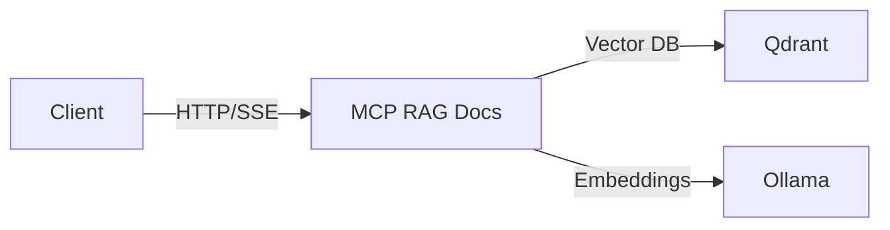
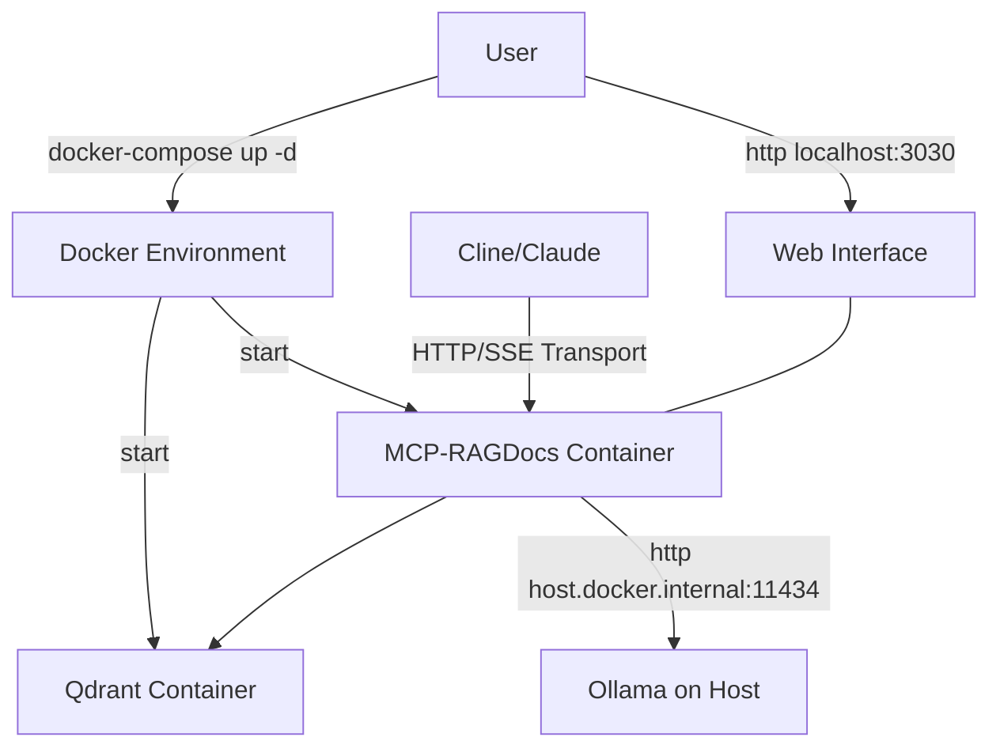

# HTTP/SSE MCP RAG Documentation Server

A containerized MCP server implementation providing tools for retrieving and processing documentation through vector search. This fork adds HTTP/SSE transport capabilities, enabling the service to run as a Docker container accessible over the network.

## Overview

This project enhances the original [RAG Documentation MCP Server](https://github.com/rahulretnan/mcp-ragdocs) with HTTP/SSE transport, allowing AI assistants to connect to it over the network rather than through stdio. This makes it ideal for containerized deployments and daemon mode operation.



## Features

### Core RAG Documentation Features

- **Vector Search**: Find relevant documentation chunks using semantic search
- **Multiple Sources**: Support for various documentation formats and sources
- **Web Interface**: Browser-based interface for managing documentation
- **Embeddings**: Support for local (Ollama) and cloud-based (OpenAI) embeddings

### HTTP/SSE Transport Enhancements

- **Network Access**: Connect to the server from any machine on the network
- **Containerized Deployment**: Run as a Docker container with proper networking
- **Daemon Mode**: Operate without requiring direct stdin/stdout access
- **Accessible API**: Simple HTTP-based API for tool integration

## Quick Start

### Using Docker Compose

The easiest way to get started is with Docker Compose:

```bash
# Clone the repository
git clone git@github.com:amir-arad/mcp-ragdocs.git

# Start the services
docker-compose up --build
```

### Access Points

- **Web Interface**: `http://localhost:3030`
- **MCP Server**: `http://localhost:3031/sse`

### Explore!

Use [MMCP Inspector](https://modelcontextprotocol.io/docs/tools/inspector) to connect to `http://localhost:3031/sse` and start interacting with your new documentation search engine.

Open `http://localhost:3030` in a browser for a traditional human interface.

## Configuration

### Cline Configuration

Add this to your `cline_mcp_settings.json`:

```json
{
  "mcpServers": {
    "rag-docs": {
      "url": "http://localhost:3031/sse",
      "disabled": false
    }
  }
}
```

### Environment Variables

The service can be configured with these environment variables:

| Variable             | Description                      | Default                             |
| -------------------- | -------------------------------- | ----------------------------------- |
| `EMBEDDING_PROVIDER` | Primary embedding provider       | `ollama`                            |
| `EMBEDDING_MODEL`    | Model to use for embeddings      | `nomic-embed-text`                  |
| `OLLAMA_BASE_URL`    | URL for Ollama service           | `http://host.docker.internal:11434` |
| `QDRANT_URL`         | URL for Qdrant vector database   | `http://qdrant:6333`                |
| `PORT`               | Port for web interface           | `3030`                              |
| `OPENAI_API_KEY`     | OpenAI API key (if using OpenAI) | -                                   |
| `FALLBACK_PROVIDER`  | Backup embedding provider        | -                                   |
| `FALLBACK_MODEL`     | Model for fallback provider      | -                                   |

## Available Tools

The MCP server provides these tools:

1. **search_documentation**: Search documentation using vector search
2. **list_sources**: List all available documentation sources
3. **extract_urls**: Extract URLs from text and check if they're already indexed
4. **remove_documentation**: Remove documentation from a specific source
5. **list_queue**: List all items in the processing queue
6. **run_queue**: Process all items in the queue
7. **clear_queue**: Clear all items from the processing queue
8. **add_documentation**: Add new documentation to the processing queue

## Architecture

The HTTP/SSE transport implementation modifies the original architecture:



## Troubleshooting

### Connection Issues

If the server doesn't respond:

1. Check if ports 3030 and 3031 are open:

```bash
curl http://localhost:3030
curl http://localhost:3031
```

2. View container logs:

```bash
docker-compose logs .
```

3. Run the diagnostic script:

```bash
docker-compose exec . /app/diagnostic.sh
```

### Embedding Problems

If embeddings fail:

1. Ensure Ollama is running on your host machine
2. Configure OpenAI as a fallback provider if needed

## Acknowledgments

This project is a fork with the following attributions:

- Original [mcp-ragdocs](https://github.com/qpd-v/mcp-ragdocs) by qpd-v
- Enhanced version by Rahul Retnan ([@rahulretnan](https://github.com/rahulretnan/mcp-ragdocs))
- HTTP/SSE transport implementation as documented in this repository

Special thanks to all the original developers and contributors who made this work possible.
